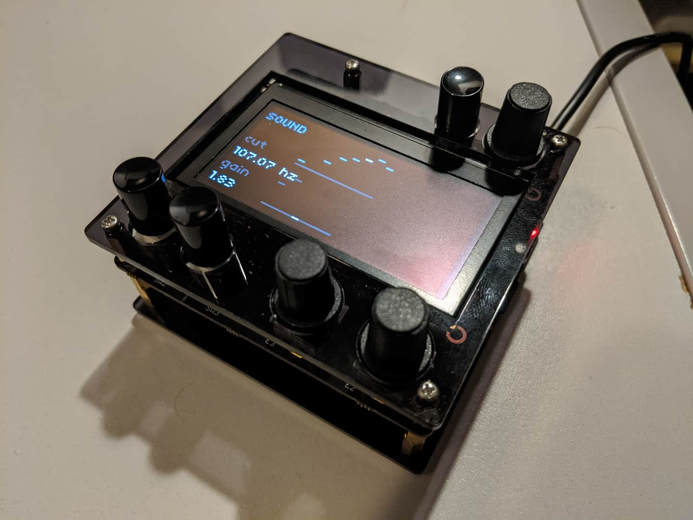

# Norns DIY: top/bottom panels

Plans and DXF files for panels to lasercut for your [DIY monome norns][nornsdiy]

## Contents

`norns-diy-panels.dxf` is what you want. It contains:

* baseplate
* top with "small" encoder cutouts
* top with encoder cutouts suitable for skirted Sifam/Selco knobs (cutout about 14.5mm in diameter)
* four 'spacers'

## Usage

Cut the baseplate, spacers, and top-panel of your choosing from 3mm acrylic.

When you cut them, double-check that the _width_ of the top or baseplate is 88.106mm. If it is not, some scaling nonsense has happened somewhere. I always check the size in my lasercutter software matches the size in the CAD tool I require.

Assemble with M2.5 hardware. The exploded diagram PDF shows how they will go together. You will need, hardware-wise:

* 2x 20mm M2.5 f-f standoff
* 2x 16mm M2.5 f-f standoff
* 4x 10mm M-F standoff (depicted as F-F in diagram)
* 2x M2.5 nut
* 6x M2.5x6mm screws
* 4x M2.5x10mm screws (8mm also works in a pinch)

To assemble, from top-to-bottom:

* take the top panel. 4x 6mm screws go through it from the top, into 4x 10mm F-M standoffs.
* Male end of standoffs goes through norns shield (with screen already attached)
* 16mm standoffs attach to rearmost male protrustions of 10mm standoffs. (These are shown at an incorrect position on the diagram; they should be _above_ the Pi board. You will work it out)
* 20mm standoffs attach to frontmost male protrusions of 10mm standoffs
* Attach the Raspberry Pi.
* Now see how much spacing you need between the Pi and the baseplate. you ideally will use the 3mm spacers under the four holes in the Pi and the plate; if 3mm is too thick, use spare M2.5 nuts.
* Flip the norns over. Place the spacers, if necessary, over the four holes on the Pi board. Carefully align the baseplate with them. Screw in the 8mm/10mm screws into the two holes going into standoffs.
* Place a screw through each of the remaining holes on the Pi, and use a nut to secure it.
* Finally, place two 6mm screws through the baseplate into the long 20mm headers.
* Add rubber feet to the base to taste.
* Attach encoder knobs and buttons.

I managed to assemble all the spacers I required from [this kit of Raspberry Pi spacers][spacerkit]. I recommend cutting the panels and working out what you will need _before_ ordering it.

This design does not support the screen. I should probably do that. My screen had **M2** hardware in the corners. Even a simple M-F standoff would help support it a bit.

## Licence

This design is issued under a "works for me". Licence. You may find these instructions, diagrams, and panels are not of assistance, or do not work for you. Sorry. Suggest improvements. No support is supplied or should be expected, though it may still be forthcoming.

[nornsdiy]: https://llllllll.co/t/diy-norns-shield/27638
[spacerkit]: https://www.amazon.co.uk/QLOUNI-Standoff-Stainless-Male-Female-Assortment/dp/B0778JRXPS/ref=sr_1_2